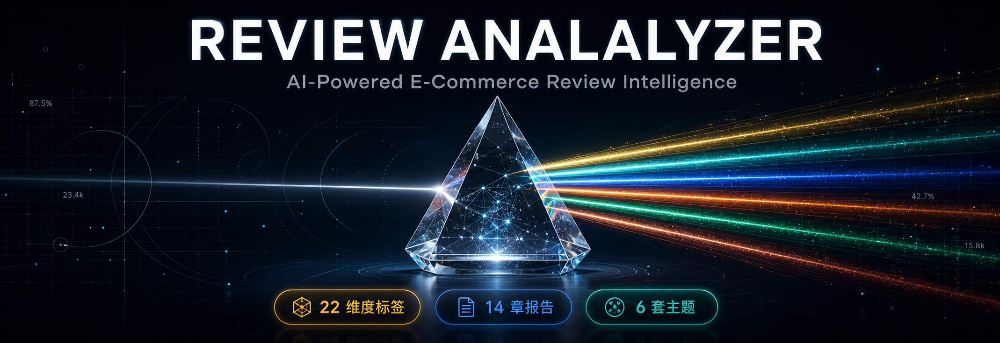

# 评论深度分析Skill

<div align="center">



# Review Analyzer Skill

**一款适用于多场景评论内容的AI深度分析工具**

**想了解更多最新AI行业动态，AI+电商/广告的行业实践方法，人与AI如何协作共生的思考，请关注公众号：【新西楼】**


[](LICENSE)
[](https://www.python.org/downloads/)
[](https://github.com/buluslan/review-analyzer-skill)
[](README_EN.md)
[](README.md)

**14章深度洞察报告 | 6套主题可视化看板 | 飞书文档同步 | Agent原生架构**

**Created By Buluu@新西楼**

</div>

---

## 项目简介

Review Analyzer Skill 是一款 **Agent 原生** 的多场景评论内容深度分析工具，适配 Claude Code、OpenCode 等主流 AI Coding Agent。支持本地 CSV 数据导入和 [Sorftime](https://www.sorftime.com/) 平台数据对接，零 API Key 即可运行。

### V2.0 核心升级

| 特性 | V1.0 | V2.0 |
|------|------|------|
| 分析引擎 | Gemini API + CLI 双模式 | **CLI 单一模式**（零 API Key） |
| 数据源 | 本地 CSV | **本地 CSV + Sorftime 平台** |
| 洞察报告 | 7 章基础分析 | **14 章深度洞察**（含行动决策仪表盘） |
| 可视化看板 | 1 套黑金模板 | **6 套主题模板**（玻璃拟态 + Chart.js 主题化） |
| 飞书集成 | 无 | **完整同步**（文档 + 白板 + mermaid 图表） |
| 架构 | Python 脚本 | **Agent 原生 Skill**（SKILL.md 指令驱动） |
| 打标并发 | 2 | **4**（提速 50%） |

### 工作流程

```
数据输入: 本地 CSV 或 Sorftime 平台
     ↓
Phase 1: AI 深度打标（并发4，22维度标签）
Phase 2: 用户画像识别（3-4个画像，3正+3负黄金样本）
Phase 3: 洞察报告生成（14章结构化报告）
Phase 4: 统一输出（MD + HTML看板 + 飞书同步）
```

> 📄 **[在线查看完整洞察报告示例（飞书文档）](https://my.feishu.cn/docx/GMv7dBzlXo5wblxVaWGclEernib)** — 包含 14 章完整内容 + 飞书白板 mermaid 图表

---

## 核心特性

### 📊 22维度智能标签

全面覆盖评论信息的8大维度：

```
人群维度 (4): 性别、年龄段、职业、购买角色
场景维度 (1): 使用场景
功能维度 (2): 满意度、具体功能
质量维度 (3): 材质、做工、耐用性
服务维度 (5): 发货速度、包装质量、客服响应、退换货、保修
体验维度 (4): 舒适度、易用性、外观设计、价格感知
市场维度 (2): 竞品对比、复购意愿
情感维度 (1): 总体评价
```

### 🎨 6套主题可视化看板

**可直接用于工作汇报**的 HTML 报告，共享基座架构确保内容结构统一：

| 主题 | 风格 | 适用场景 |
|------|------|----------|
| premium-gold | 黑金奢华 + Playfair Display | 高管汇报、品牌展示 |
| dark-tech | 赛博朋克 + Cyan + 毛玻璃 | 技术团队、数据驱动 |
| linear-minimal | 极简白蓝 + 清透玻璃 | 产品评审、简洁汇报 |
| posthog-analytics | 暖白橙色 + 暖色玻璃 | 数据分析、运营复盘 |
| stripe-executive | 翡翠绿 + 翡翠玻璃 | 金融企业、投资决策 |
| warm-editorial | 纸色铜色 + 纸感玻璃 | 品牌报告、编辑风格 |

每个看板包含：11个板块、交互式 Chart.js 图表（主题色板）、响应式设计、玻璃拟态卡片效果。

### 📋 14章深度洞察报告

1. 洞察总览（核心判断 + 战略方向 + 市场定位）
2. 核心用户画像（多维度画像 + 核心诉求 + 原声引用）
3. 核心卖点与价值验证（数据支撑 + 用户原话）
4. 主要痛点与负面归因（严重性 + 瀑布效应 + 行动建议）
5. 改进建议与优先级（P0/P1/P2 + 预期收益）
6. 潜在机会与差异化（数据 + 建议）
7. 典型用户深度解析
8-12. 深度内容章节
13. 行动决策仪表盘
14. 数据附录

### 📦 多格式输出 + 飞书同步

| 输出 | 格式 | 说明 |
|------|------|------|
| 打标数据 | CSV | 原始评论 + 22维度标签 |
| 洞察报告 | Markdown | 14章深度分析 |
| 可视化看板 | HTML | 6套主题可选，玻璃拟态 |
| 飞书文档 | — | 自动同步报告 + mermaid白板 |

---

## 系统要求

| 要求 | 详情 |
|------|------|
| **操作系统** | macOS / Linux / Windows |
| **Python** | **3.10 或更高版本**（推荐 3.11.x） |
| **Agent CLI** | Claude Code CLI、OpenCode CLI 等任一 AI Coding Agent |
| **内存** | 建议 4GB+ |
| **飞书同步（可选）** | 需安装 [lark-cli](https://github.com/germalli/lark-cli) 并完成认证登录 |

> **飞书同步说明**：如需将分析结果同步到飞书文档，需提前安装 `lark-cli`（`npm install -g lark-cli`）并完成 `lark-cli login` 认证。如果未安装，工具会自动跳过飞书同步步骤，不影响其他功能。

---

## 快速开始

### 方式1：使用 skills.sh 生态安装（推荐）

```bash
npx skills add buluslan/review-analyzer-skill
```

安装后，在 Claude Code 中直接用自然语言调用：

```bash
# 示例1：指定文件分析
请分析这个产品的评论：reviews.csv

# 示例2：描述需求
帮我做一下竞品评论的深度分析
```

### 方式2：手动克隆仓库

```bash
git clone https://github.com/buluslan/review-analyzer-skill.git
cd review-analyzer-skill
pip install -r requirements.txt
```

### 运行参数

```bash
# === 数据输入方式 ===

# 方式1：本地 CSV 文件
python3 main.py your_reviews.csv --max-reviews 200

# 方式2：Sorftime 平台数据（需配置 SORFTIME_API_KEY）
python3 main.py --source sorftime --asin B09XYZ123 --site US --max-reviews 200

# === 完整参数 ===
python3 main.py your_reviews.csv \
  --asin B09XYZ123 \
  --template premium-gold \
  --feishu-sync auto \
  --concurrent 4 \
  --creator "Your Name"

# === 可视化模板（6选1，或 none 跳过） ===
--template premium-gold|dark-tech|linear-minimal|posthog-analytics|stripe-executive|warm-editorial|none

# === 飞书同步（需提前安装 lark-cli 并认证） ===
--feishu-sync auto|manual|skip

# === 快速重放（跳过打标，从已打标CSV直接执行 Phase 2-5） ===
python3 replay_phase2to5.py output/B09XYZ123-评论分析项目-6.1/评论采集及打标数据_B09XYZ123.csv
```

---

## CSV文件格式要求

工具支持自动模糊匹配列名，CSV文件需包含：

| 必需列 | 可选列名（模糊匹配） |
|--------|---------------------|
| 评论内容 | 内容/评价/body/review/text/comment |
| 评分 | 打分/rating/score/star |
| 时间（可选） | 时间/date/日期/time |

**示例**：详见 `examples/reviews_sample.csv`

---

## 输出示例

运行完成后，将在 `output/` 目录生成以下文件：

### 1. CSV标签数据
```csv
评论内容,评分,性别,年龄段,职业,购买角色,使用场景,满意度...
"The quality is amazing",5,女性,25-34岁,白领,自用,家用办公,高...
```

### 2. Markdown洞察报告
```markdown
# 产品分析洞察报告

## 核心发现
- 用户满意度：92%
- 主要优势：材质优良、设计美观
- 改进建议：优化包装、增强耐用性
...
```

### 3. HTML可视化看板
- 黑金奢华配色
- 交互式图表
- 动态数据展示
- 创作者署名（鎏金发光效果）

---

## 使用场景

### 场景1：产品优化
分析自己产品的评论，发现用户痛点，优化产品功能和设计。

### 场景2：竞品分析
分析竞品评论，了解竞争对手的优势和劣势，寻找差异化机会。

### 场景3：市场调研
批量分析多个产品的评论，了解市场需求、用户偏好和行业趋势。

### 场景4：用户洞察
深度了解目标用户群体，构建精准用户画像，优化营销策略。

---

## 项目结构

```
review-analyzer-skill/
├── main.py                      # V2.0 主入口（4 Phase 流程）
├── SKILL.md                     # Agent 指令文件（Claude Code Skill）
├── replay_phase2to5.py          # 快速重放脚本（跳过打标）
├── requirements.txt             # Python 依赖
├── .env.example                 # 环境变量模板
├── src/
│   ├── config.py                # CLI 单一模式配置
│   ├── template_engine.py       # 统一模板引擎（Jinja2 SSR + 共享基座）
│   ├── chart_engine.py          # Chart.js 图表配置生成
│   ├── insights_generator.py    # 14章洞察报告生成（CLI subprocess）
│   ├── output_manager.py        # 输出管理（MD + HTML + 飞书同步）
│   ├── feishu_sync.py           # 飞书文档 + 白板同步
│   ├── report_generator.py      # 报告生成（兼容层）
│   ├── data_fetchers/           # 数据接入层（Sorftime + CSV）
│   ├── prompts/                 # 14章 Prompt 体系
│   └── templates/               # 可视化看板模板
│       ├── base/                # 共享基座
│       │   ├── dashboard_base.html   # 基座 HTML（Jinja2）
│       │   └── dashboard_base.css    # 基座布局 CSS
│       ├── premium-gold/        # 黑金主题
│       ├── dark-tech/           # 赛博朋克主题
│       ├── linear-minimal/      # 极简蓝白主题
│       ├── posthog-analytics/   # 暖橙分析主题
│       ├── stripe-executive/    # 翡翠企业主题
│       └── warm-editorial/      # 报纸编辑主题
├── assets/                      # 静态资源（3D 头像）
├── examples/                    # 示例数据 + 输出样例
├── tools/                       # 工具脚本
├── references/                  # 参考文档
└── docs/                        # 用户文档
```

---

## 常见问题

<details>
<summary><b>Q1: V2.0 和 V1.0 有什么区别？</b></summary>

**A**: V2.0 是全面升级：
- **零 API Key**：删除 Gemini 依赖，统一 CLI 单一模式
- **14章报告**：从 7 章扩展到 14 章深度洞察
- **6套主题看板**：从 1 套扩展到 6 套（含玻璃拟态质感）
- **飞书同步**：自动同步文档 + mermaid 白板
- **共享基座架构**：bug 只修一处，新增模板只需一个 CSS 文件
</details>

<details>
<summary><b>Q2: 需要什么 API Key？</b></summary>

**A**: V2.0 **无需任何 API Key**。全程使用 Claude Code / OpenCode 内置模型，消耗你的 Claude 配额。
</details>

<details>
<summary><b>Q3: CSV 文件格式有什么要求？</b></summary>

**A**: CSV 文件需要包含以下列（支持模糊匹配）：
- **评论内容**：内容/评价/body/review
- **评分**：打分/rating/score
- **时间**（可选）：时间/date/日期

详见 `examples/reviews_sample.csv`
</details>

<details>
<summary><b>Q4: 如何选择可视化模板？</b></summary>

**A**: 6 套模板对应不同场景：
- **premium-gold**：高管汇报、品牌展示（默认）
- **dark-tech**：技术团队、数据分析
- **linear-minimal**：产品评审、简洁汇报
- **posthog-analytics**：运营复盘、增长分析
- **stripe-executive**：金融企业、投资决策
- **warm-editorial**：品牌报告、杂志风格

使用 `--template none` 可跳过看板生成。
</details>

<details>
<summary><b>Q5: 支持哪些电商平台？</b></summary>

**A**: 理论上支持所有提供评论导出的电商平台：Amazon、eBay、AliExpress、Shopee、淘宝/天猫，以及其他 CSV 格式评论数据。
</details>

---

## 与其他工具对比

| 特性 | Review Analyzer Skill V2.0 | 其他工具 |
|------|---------------------------|---------|
| **架构** | Agent 原生 Skill | 通常为独立脚本 |
| **API Key** | 零（纯 CLI） | 多数需要 API Key |
| **洞察报告** | 14章深度分析 | 基础统计 |
| **可视化** | 6套主题 + 玻璃拟态 | 单一模板或无 |
| **飞书集成** | 文档 + 白板自动同步 | 多不支持 |
| **数据隐私** | 本地处理，不上传第三方 | 多为在线服务 |
| **模板扩展** | 新增主题 = 1个 CSS 文件 | 需完整重写 |

---

## 路线图

- [x] **v1.0.0** - 首个正式发布（22维度标签 + 双模式 + HTML看板）
- [x] **v2.0.0** - Agent 原生版（14章报告 + 6套主题 + 飞书同步 + 共享基座架构）
- [ ] **v2.1.0** - Web 端增强（前端模板选择器 + 截图导出）
- [ ] **v3.0.0** - 多平台分析（批量 ASIN + 竞品对比报告）

---

## 许可证

本项目采用 [MIT License](LICENSE) 开源许可证。

---

## 致谢

- 感谢 Anthropic 提供 Claude AI
- 感谢 Google 提供 Gemini API
- 灵感源自开源社区的智慧贡献

### 贡献者

感谢以下社区贡献者对本项目的贡献：

| 贡献者 | 贡献内容 |
|--------|---------|
| [@zeropool](https://github.com/zeropool) | OpenCode CLI 引擎支持、URL 远程输入、头像资源压缩（[PR#1](https://github.com/buluslan/review-analyzer-skill/pull/1)） |

> 社区贡献者在提交 PR 后，维护团队会进行代码审查。为确保代码质量与稳定性，部分 PR 可能会以改进版本合入，而非直接 merge 原始提交。

---

## 技术支持

- **Issues**: [GitHub Issues](https://github.com/buluslan/review-analyzer-skill/issues)
- **联系Builder，请备注【github】**：


---

<div align="center">

**如果这个项目对您有帮助，请给一个 ⭐️**

Made with ❤️ by Buluu@新西楼

**专为跨境电商从业者打造 ❤️**

[⬆ 返回顶部](#review-analyzer-skill)

</div>
