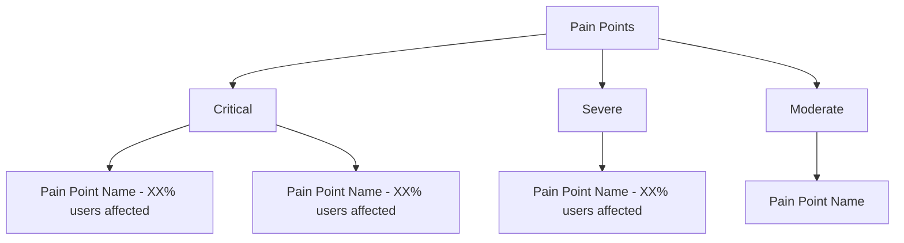

## 五、主要痛点与负面归因

### 核心要求

深度剖析用户不满意的根源。不仅列出问题，更要追溯原因、评估严重性。本章节是改进建议（第六章）的直接输入。

### 必须输出：痛点严重性矩阵

在本章节开头，**必须**输出以下 mermaid flowchart 图（注意：代码块内必须全部使用英文，中文会导致渲染失败）：



根据痛点严重程度和影响范围构建决策树结构。

### 分析框架

#### 1. 四级分类

按严重程度将痛点分为四级：

| 等级 | 定义 | 典型表现 |
|------|------|---------|
| 致命（Critical） | 导致退货、投诉、差评的核心原因 | 产品无法正常使用、安全隐患 |
| 严重（Severe） | 显著降低用户体验但未导致退货 | 核心功能低于预期、频繁出现的小问题 |
| 一般（Moderate） | 用户会抱怨但可以容忍 | 非核心功能瑕疵、外观小问题 |
| 轻微（Minor） | 少数用户提及，影响有限 | 个人偏好不符、极低频偶发问题 |

#### 2. 痛点深度分析

对每个痛点使用洞察卡片结构：

```
### 痛点 #N：[痛点名称]
**严重性**：[致命/严重/一般/轻微]
**核心发现**：[一句话概括问题本质]
**数据支撑**：在负面评价中占比 XX% (N=XX)
**根源分析**：[具体到"哪个部件/场景出了什么问题"]
**归因分类**：[产品设计缺陷 / 质量控制问题 / 预期管理不当 / 物流损坏 / 使用不当]
**用户原话**：
> "[评论原文]" — [用户画像/情感]
**影响范围**：[受影响的用户群体和使用场景]
**瀑布效应**：[是否引发连锁问题，如：做工粗糙 → 怀疑质量 → 不敢复购]
```

### 必须包含的内容

- 每个痛点必须有出现频次数据
- 每个痛点必须关联至少 1 条用户原话
- 根源分析必须具体到"为什么"，不能停留在"是什么"
- 必须输出 mermaid flowchart 图（英文，不用quadrantChart）
- 区分"单次偶发"与"系统性问题"

### 写作规范

- 致命和严重痛点优先详细分析
- 一般和轻微痛点可合并简述
- 每个痛点编号（#1, #2...），便于第六章引用
- 篇幅控制在 400-500 字
