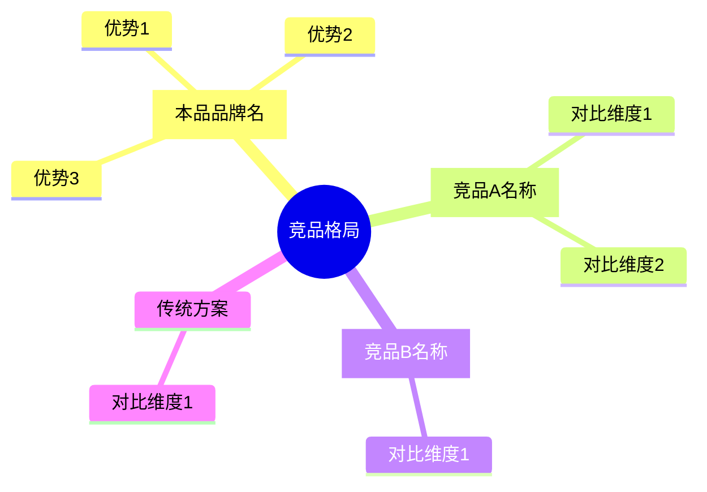

## 七、潜在机会与差异化

### 核心要求

从竞品情报和蓝海发现两个维度，挖掘差异化机会。回答"我们可以在哪里赢"。

### 必须输出：竞品定位思维导图

在本章节中，**必须**输出以下 mermaid mindmap 展示竞品定位格局：



### 分析框架

#### 1. 竞品情报

- 用户评论中提及了哪些竞品品牌？各提及几次？
- 正面对比：我们在哪些方面优于竞品
- 负面对比：竞品在哪些方面优于我们
- 有竞品使用经验的用户对我们产品的评价如何

#### 2. 差异化机会（3-5 条）

聚焦具体的差异化机会，每条使用洞察卡片结构：

```
### 机会：[机会名称]

- **核心发现**：[一句话概括差异化点]
- **数据支撑**：[提及次数、评价倾向]
- **用户原话**：
  > "[评论原文]" — [情感标签]
- **行动建议**：[如何利用这个机会]
```

#### 3. 蓝海发现

- 是否存在小众但满意度极高的人群？
- 是否存在未被充分满足的使用场景？
- 简述即可，控制在 2-3 句话

### 必须包含的内容

- 必须输出 mermaid mindmap
- 竞品对比必须有具体数据（提及次数）
- 每个差异化机会至少 1 条用户原话
- 聚焦差异化机会（3-5 条），不做全面竞品分析

### 写作规范

- 竞品名称使用实际品牌名，不使用代称
- 差异化机会按潜在价值排序
- 篇幅控制在 300-400 字
