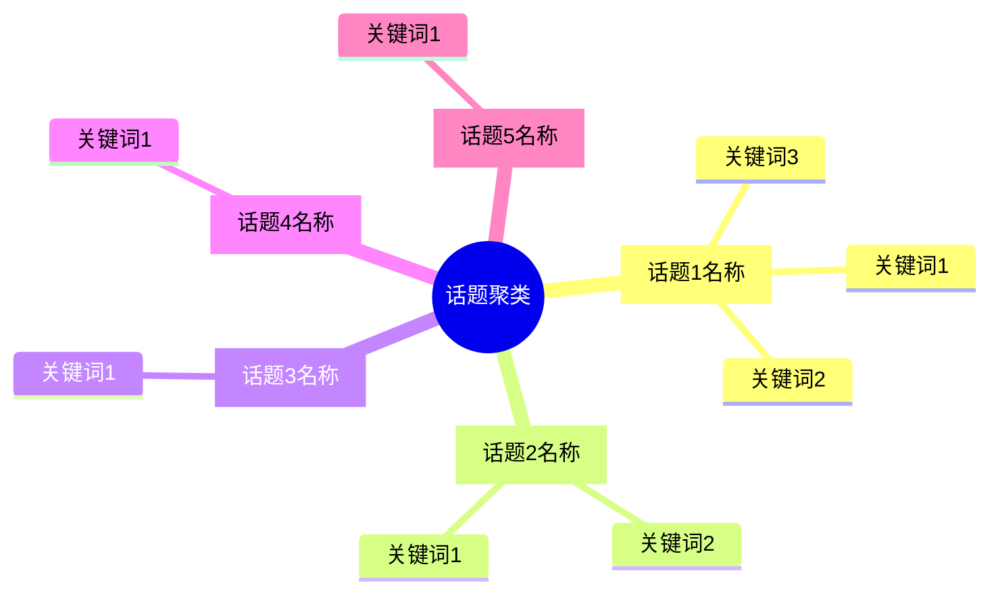

## 十一、关键词与话题聚类

### 核心要求

从评论文本中提取高频关键词，按语义关联聚类为话题，揭示用户关注的微观焦点。精简为 Top 5 话题。

### ⚠️ 强制要求 [MUST]：话题聚类思维导图

在本章节中，**必须**输出 mermaid mindmap 代码块来展示话题聚类。如果你不输出这段 mermaid 代码，该章节将无法生成可视化图表，飞书白板将显示为空。

输出格式如下（注意必须包含完整的 ```mermaid 起止标记）：



**语言规则**：mermaid 节点文本默认使用中文（如"话题聚类""自动清洁"等），只有英文专有名词和用户原话保持英文。不要将中文翻译为英文。

输出前请确认：你的回答中是否包含 ```mermaid 代码块？如果没有，请补上。

### 分析框架

#### 1. 话题聚类（Top 5）

将关键词按语义关联归纳为 5 个核心话题簇。每个话题包含：

```
### 话题：[话题名称]
- **核心发现**：[一句话概括用户在讨论什么]
- **数据支撑**：XX% 的评论涉及此话题 (N=XX)
- **情感倾向**：[正面为主 / 负面为主 / 两极分化]
- **核心关键词**：[词1, 词2, 词3]
- **用户原话**：
  > "[评论原文]" — [情感标签]
```

#### 2. 高优话题识别

识别两类核心话题：
- **高优改进话题**：高提及 + 高负面
- **核心优势话题**：高提及 + 高正面

各用 1-2 句话说明即可。

### 必须包含的内容

- ⚠️ **必须**输出完整的 ```mermaid 代码块（含 ```mermaid 起始标记和 ``` 结束标记），这是不可跳过的输出项
- Top 5 话题簇（不超过 5 个）
- 每个话题至少 1 条用户原话
- 每个话题标注情感倾向
- 精简关键词列表为每个话题 2-4 个核心词

### 写作规范

- 不要求 Top 30 关键词列表
- 不要求话题交叉分析表格
- 不要求话题共现网络描述
- 每个话题控制在 5-8 行
- 篇幅控制在 300-400 字
