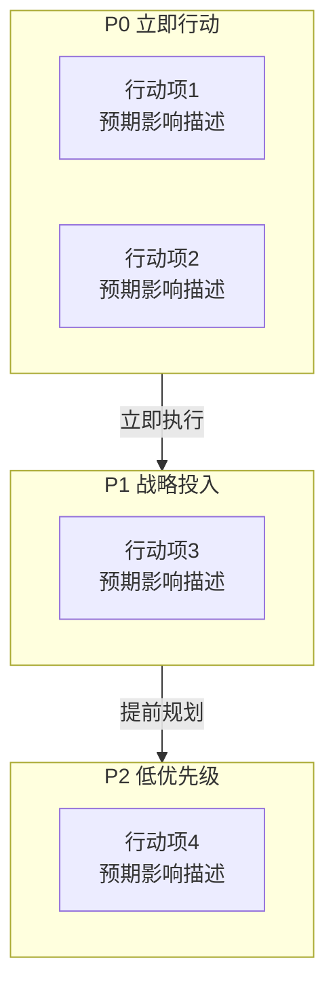

## 十三、行动决策仪表盘

### 分析目标

将全部分析结论整合为一张可执行的决策看板，帮助决策者快速判断"该做什么、先做什么"。

### ⚠️ 强制要求 [MUST]：行动优先级矩阵

在本章节开头，**必须**输出 mermaid flowchart 代码块来展示行动优先级矩阵。如果你不输出这段 mermaid 代码，该章节将无法生成可视化图表，飞书白板将显示为空。

输出格式如下（注意必须包含完整的 ```mermaid 起止标记）：



**语言规则**：mermaid 节点文本默认使用中文，不要翻译为英文。注意 mermaid 节点内不要使用引号（""）等特殊字符，如有需要用书名号或直接省略。

输出前请确认：你的回答中是否包含 ```mermaid 代码块？如果没有，请补上。

坐标值根据行动的实施难度（x轴，越右越难）和影响力（y轴，越上越高）综合评定。

### 格式要求

#### 1. 行动项表格

使用紧凑表格格式：

```
| 行动项 | 优先级 | 预期影响 | 来源 |
|--------|--------|---------|------|
| [行动1] | P0 | [1句话] | Ch5-#1 |
| [行动2] | P0 | [1句话] | Ch5-#2 |
| [行动3] | P1 | [1句话] | Ch5-#3 |
```

#### 2. 快速胜利清单

列出 P0 行动项的具体执行要点，每项 1-2 句话。

#### 3. 决策建议总结

2-3 句话概括核心结论和行动方向。

### 必须包含的内容

- ⚠️ **必须**输出完整的 ```mermaid 代码块（含 ```mermaid 起始标记和 ``` 结束标记），这是不可跳过的输出项
- 行动项表格格式：`| 行动项 | 优先级 | 预期影响 | 来源 |`
- 每个行动项关联来源章节（如 Ch5-#1）
- 快速胜利清单（P0 项）
- 决策建议总结（2-3 句话）

### 写作规范

- 去掉 1-5 分评分体系，改用象限直观展示
- 去掉预期满意度/差评率/复购率的具体数值预估
- 行动项从前面所有章节中提取，去重合并
- 篇幅控制在 200-300 字
